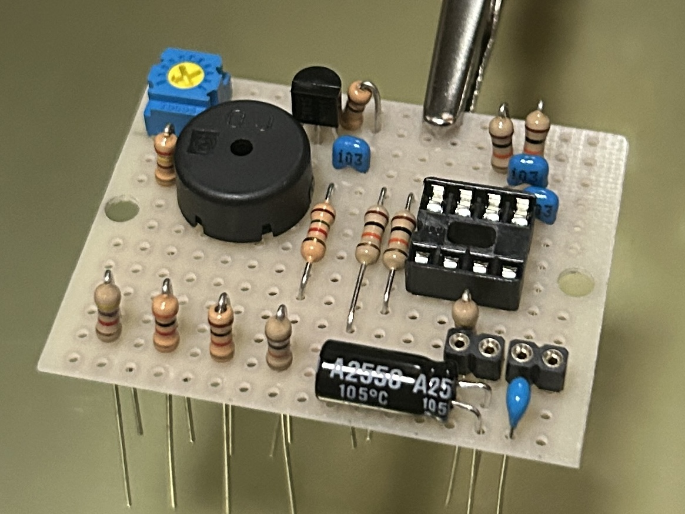
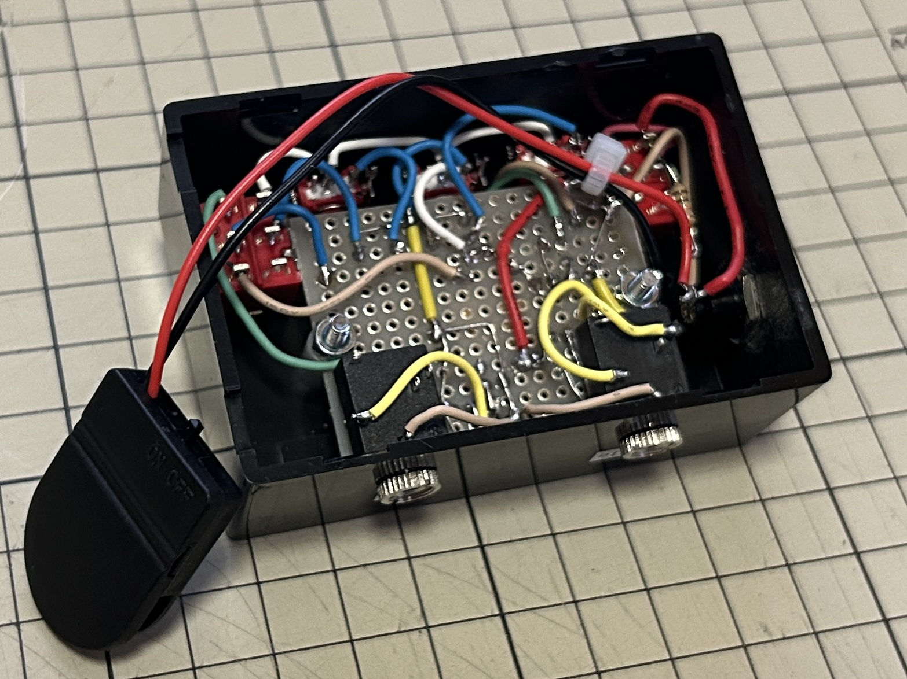
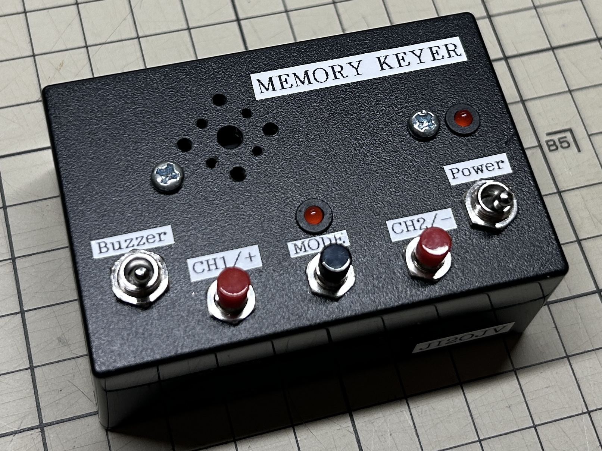

# 2CH Electronic Memory Keyer Type2 [EK_T2]

ATtiny85あるいはArduinoを使用したコンパクトで多機能な2CHメモリキーヤーです。
省電力設計とEEPROMによるメッセージ保存機能を備えており、移動運用やQRPリグでの使用に最適です。

## 特徴
- **キーイングモード**: スクイズ操作（両方のレバーを閉じる操作）に対応したIambic Mode Bを採用。
- **2CHメッセージメモリ**: 80符号(スペース含む)までのメッセージをCH1とCH2の2つまで不揮発メモリEEPROMに保存。メッセージは打鍵により入力
- **Mode選択**:Modeボタンで各種動作を選択(Mode1:キー速度調整 / Mode2:メッセージ記憶 / Mode3:キー速度記憶)
- **キー速度調整**: 外部ボタン(CH1+/CH2-)により、10～30WPMで変更可能(Mode3でEEPROMに保存可能)
- **送信/練習モード切替**: 2回路2接点スイッチにより、送信出力とサイドトーン(内蔵ブザー)を物理的に切り替え
- **省電力設計**: ATtiny85の低消費電力特性を活かし、電池駆動(CR2032)でも長時間の運用が可能

## リポジトリの構成
- `2ch-cw-memory-keyer.ino`: ATtiny85用ソースコード（Arduino IDEで開いてください）
- `2ch-cw-memory-keyer_Schematic.pdf`: 回路図

## 基本動作＆操作
  各種設定操作(Mode1～3)は、スイッチがいずれの状態でも可能。
  <Tx側の場合>送信は抑制(ガード)され、LED点灯のみでガイド /
  <ブザー側の場合>ブザー吹鳴とLED点灯でガイド

- **キー速度確認**
  電源ON時に、ブザー吹鳴(物理スイッチブザー側のみ)＆LED点灯で現在記憶のキー速度をモールス符号で提示

- **キー速度(WPM)変更(Mode1)**:
  1.Modeボタンを1回点灯・吹鳴するまで長押し(約1秒)
  2.CH1+(アップ) or CH2-(ダウン)で調整
  3.Modeボタン押しで確定(1回点灯・吹鳴)
  　　 
- **メッセージ再生**:
  CH1またはCH2ボタンを短押し
  
- **メッセージ記録(Mode2)**:
  1.Modeボタンを2回点灯・吹鳴するまで長押し(約2秒)
  2.CH1またはCH2ボタンを押しで、各CH記録モード
  3.パドルで入力
  4.Modeボタン押しで決定⇒EEPROMへ保存
  
- **キー速度記憶(Mode3)**: 
  Modeボタンを3回点灯・吹鳴するまで長押し(約3秒)⇒EEPROMへ保存

## ハードウェア仕様
- **MCU**: ATtiny85
- **電源**: 3.3V〜5V
- **UI**: 
  - ボタン(Mode/CH1+/CH2-)（ADC読み取りによる省ピン構成）
  - パドル接続（DOT/DASH）
  - 圧電サウンダー（サイドトーン用）
  - 送信用トランジスタ (2SC1815等)

----------------------------------------------------------------------------
## English Summary
This is a compact, multi-functional 2-channel CW memory keyer built with **ATtiny85**.

### Key Features
- **Keying Mode**: Iambic Mode B (Squeeze keying supported).
- **2-Channel Message Memory**: Stores up to 80 characters per channel in EEPROM.
- **Fail-Safe "Tx Guard"**: While in configuration modes (Mode 1-3), 
　　　　　　　　　　　　　　　　  transmitter output is suppressed. Guided by LED/Buzzer only.
- **Physical Tx/Tone Switch**: Easily toggle between actual transmission and side-tone practice.
- **Ultra-Low Power**: Optimized for battery operation (e.g., CR2032).

### Operation Guide
- **Mode 1**: WPM adjustment (10-30 WPM).
- **Mode 2**: Message recording.
- **Mode 3**: Save current WPM to EEPROM.
- **Playback**: Short press CH1 or CH2.

----------------------------------------------------------------------------
## ライセンス / License

このプロジェクトは **GNU General Public License v3.0 (GPL v3.0)** の下で公開されています。
This project is licensed under the **GNU General Public License v3.0 (GPL v3.0)**.

### ルール / Rules
- オリジナル作者 **N.Nagae (JI2OJV)** の著作権表示を保持すること。
- 改良版を公開・配布する場合は、同じGPLライセンスでソースコードを公開すること。
- 詳細は [LICENSE](LICENSE) ファイルを参照してください。
- You must retain the original copyright notice of **N.Nagae (JI2OJV)**.
- If you modify and redistribute this project,
  you must release the modified source code under the same **GPL v3.0** license.
- See the [LICENSE](LICENSE) file for details.

---

  「このプロジェクトは、アマチュア無線の自作文化への貢献として公開しました。
   GPL v3.0を採用しているのは、この知恵が常にオープンであり続け、
   誰かが行った素晴らしい改良が、皆様に還元されることを願っているからです。」

  "I am releasing this project as a contribution to the Amateur Radio homebrew community.
   I chose the GPL v3.0 to ensure that this knowledge remains open to everyone,
   and I hope that any brilliant improvements made by others will be shared back with the community."

---
Developed by **N.Nagae (JI2OJV) / NORI-Works**

  
  
  
  
<em>左から：内部基板、配線の様子、外観</em>

